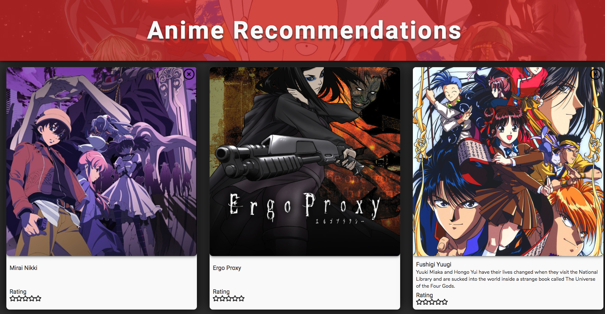

# Anime Recommendation Proof of Concept
This is an anime recommendation site proof of concept that uses matrix factorization to recommend anime.

## Dependencies
This app depends on the [matrix factorization library](https://github.com/johnpaulada/matrix-factorization-js) I built to help with the recommendation process. This app also uses the beautiful [Sweet Alert](https://sweetalert.js.org/) alert replacement library.

## How to use
1. Clone this repo with: `git clone https://github.com/johnpaulada/anime-recommendation-poc.git`.
2. Run `cd anime-recommendation-poc`.
3. Serve this app somehow. If you have PHP, you can try `php -S localhost:8000 -t .` to serve this.
4. Open `localhost:8000` on your browser.

## TODO
1. Use Web Components for the Anime Cards
2. Add more descriptions

## License
MIT